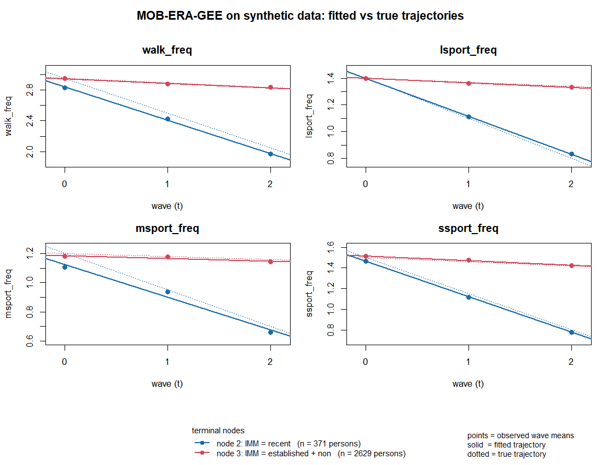

# MOB-ERA-GEE for multivariate longitudinal outcomes

Code and validation for the method used in:

> *Modeling Intersectional Heterogeneity in Multidimensional Physical Activity
> Trajectories Across Immigrant Groups: Evidence from the Canadian Longitudinal
> Study on Aging.* Sunmee Kim, University of Manitoba.

The paper is an applied study and does not develop the methodology in its text.
This repository documents the method, provides implementation checks and
simulation-based validation under the reference design, and makes those
analyses reproducible.

> **Status**: Research code accompanying an applied manuscript.
> The fixed-component Gaussian/working-independence implementation described here
> has been tested under the validation design below.
> It is not a general-purpose R package.

This README is the summary. Two documents carry the detail:
**[`docs/METHOD.md`](docs/METHOD.md)** for the specification and the reasoning
behind each design choice, and
**[`docs/VALIDATION.md`](docs/VALIDATION.md)** for the full validation report
including everything not established.

---

## Everything here runs without any data

The empirical analysis uses the Canadian Longitudinal Study on Aging (CLSA),
which cannot be redistributed: access requires an approved application, and the
CLSA Access Agreement does not permit sharing data beyond the research team.

**All methodological checks can be reproduced from seeded synthetic data
without access to CLSA data.** The synthetic reference case is built to
resemble the empirical design, so any reader can reproduce every methodological
claim below, exactly, from a clean R session.

```r
install.packages(c("partykit", "MASS", "matrixcalc"))

# from the repository root:
source("run_all.R")                  # everything except the 84-minute simulation
FULL <- TRUE; source("run_all.R")    # including it
```

or from a shell, again in the repository root:

```bash
Rscript run_all.R           # about 2.5 minutes
Rscript run_all.R --full    # adds the 1,000-replication simulation
```

---

## The model

Each person contributes three waves; each wave carries `Q = 4` continuous
outcomes. The base model is a population-averaged multivariate growth model:

```
g(mu_itq) = beta_1q + beta_2q * t          q = 1, ..., Q
```

with **fixed components** `f_const = 1` and `f_time = t`, both component
weights **constrained to 1**, giving a `2 x Q` coefficient matrix:

| row of `B` | for each outcome *q* |
|---|---|
| **`beta_1q`** | baseline expected outcome, at `t = 0` |
| **`beta_2q`** | expected change per wave |

Time is the **raw** wave index 0, 1, 2, so both rows are directly
interpretable. `R/era_gee_fixed.R` asserts `max|f_const - 1| = 0` and
`max|f_time - t| = 0` on every call — these are constraints, not estimates.

Rows are person-waves. The GEE working covariance is `Q x Q` and models
association among the four outcomes *within* a person-wave. Wave-to-wave
correlation is not explicitly parameterized in the working covariance.
Repeated observations are nevertheless treated as clustered within person
in the MOB instability inference via `mob(..., cluster = id)`; the equivalence
to subject-aggregated estimating functions is verified in
`run/02_cluster_equivalence.R`.

## The three diagnostics

All three diagnostics fit the **same full $2 \times Q$ longitudinal model**
using the raw time scale. They differ only in the component of parameter
instability that is tested.

| diagnostic | question | instability test |
|---|---|---|
| **joint** | *Which subgroups have different longitudinal trajectories?* | all $2Q$ intercept and slope parameters |
| **slope** | *Which subgroups change at different rates over time?* | $Q$ nuisance-adjusted slope scores |
| **intercept** | *Which subgroups differ in baseline level?* | the $Q$ intercept parameters |

The **joint diagnostic** is the primary MOB tree. It tests whether any part of
the multivariate intercept-and-slope structure varies across the candidate
partitioning variables $Z$. A detected split may therefore reflect differences
in baseline levels, longitudinal rates of change, or both.

The **slope diagnostic** asks the more specific question of whether longitudinal
rates of change vary across subgroups while treating the intercept parameters as
nuisance. It uses the nuisance-adjusted score

```math
U_{S \cdot I}
=
U_S - I_{SI} I_{II}^{-1} U_I
```

where $U_I$ and $U_S$ are the intercept- and slope-score blocks, respectively,
and the $I$ blocks are obtained from their empirical score covariance used for
the nuisance projection.

This adjustment is important because simply selecting the raw slope-score
columns does not, in general, isolate slope heterogeneity. With the raw time
coding used in the reference design, $t = 0,1,2$, the intercept and slope
score blocks were highly correlated (about 0.95 in the diagnostic example), so
a pure baseline difference could also produce apparent slope instability.

The nuisance-adjusted slope score removes this intercept direction. As a result,
the slope diagnostic is invariant to a shift in the time origin: rewriting

$$
\beta_1 + \beta_2 t = (\beta_1 + c\beta_2) + \beta_2(t-c)
$$

changes the intercept parameterisation but not the slope. This invariance was
verified numerically to approximately $10^{-13}$ in the synthetic checks.

The **intercept diagnostic** tests only the intercept block of the same full
model. Because time is coded so that $t=0$ is baseline in the reference
design, this diagnostic asks whether subgroups differ in their expected baseline
levels. It is used as a supplementary diagnostic rather than as a separate
model.

---

## What each script does, and what it produces

Runtimes are as measured on the reference machine (20 physical cores); the
first five together take about 2.5 minutes.

| script | claim it supports | runtime |
|---|---|---|
| `run/00_regression_test.R` | the fitted model is the specified one, and the reference case recovers the planted answer | 8 s |
| `run/01_worked_example.R` | a transparent end-to-end example, with a trajectory figure | 8 s |
| `run/02_cluster_equivalence.R` | `cluster = id` implements subject-level estimating functions | 33 s |
| `run/03_time_origin_invariance.R` | the slope diagnostic does not depend on the time origin | 35 s |
| `run/04_diagnostics_table.R` | all three diagnostics behave as intended across four truth conditions | 56 s |
| `run/05_repeated_simulation.R` | calibration, recovery and parameter accuracy over 1,000 replications | 84 min (32 workers) |
| `run/05b_summarise_simulation.R` | summarises the above — runs in seconds against the shipped result file | 5 s |

`results/simulation_R1000.rds` is included, so the simulation tables can be
reproduced without re-running the 84-minute job:

```r
source("R/synthetic_data.R")     # supplies the true parameter values
o <- readRDS("results/simulation_R1000.rds"); res <- o$res; N_REP <- o$n_rep
source("run/05b_summarise_simulation.R")
```

### `run/01_worked_example.R`

3,000 persons × 3 waves. Truth: baselines identical across immigrant groups,
recent immigrants declining much faster on all four outcomes, no other variable
having any effect.

```
Parameter instability tests (root):
              IMM       SEX      ETHN      EDU   INCNEED  HOMEOWN    URBAN
statistic  715.66    9.7120   38.2600   9.2153   25.1568   8.0897   9.0385
p.value   4.2e-141   0.9053    0.9962   1.0000    0.9711   1.0000   0.9449

Best splitting variable: IMM
Selected split: recent | non, established
```

| node | n | group | outcome | est. intercept | true | est. slope | true |
|---|---|---|---|---|---|---|---|
| 2 | 371 | recent | walk | 2.838 | 2.95 | **−0.431** | −0.45 |
| 2 | | | lsport | 1.397 | 1.40 | **−0.284** | −0.30 |
| 2 | | | msport | 1.125 | 1.20 | **−0.224** | −0.25 |
| 2 | | | ssport | 1.464 | 1.50 | **−0.344** | −0.35 |
| 3 | 2629 | non + established | walk | 2.946 | 2.95 | **−0.060** | −0.06 |
| 3 | | | lsport | 1.399 | 1.40 | **−0.033** | −0.03 |
| 3 | | | msport | 1.186 | 1.20 | **−0.019** | −0.02 |
| 3 | | | ssport | 1.517 | 1.50 | **−0.044** | −0.04 |



The intercepts land near 2.95 / 1.40 / 1.20 / 1.50 in **both** nodes, which is
the right answer — the truth had no baseline difference. The slopes separate by
roughly a factor of seven.

Including the intercepts in the model allows baseline-level differences,
when present, to be represented separately from longitudinal change rather than
being absorbed into the slope estimates. In this synthetic example, the fitted
intercepts correctly recover the planted baseline agreement between groups.

### `run/04_diagnostics_table.R`

Split variable, observed = expected in all twelve cells. `IMM` statistic in
parentheses.

| truth | joint | slope | intercept |
|---|---|---|---|
| slope-only | IMM (715.66) | IMM (484.43) | (none) (9.91) |
| intercept-only | IMM (260.87) | (none) (7.04) | IMM (186.94) |
| intercept + slope | IMM (1028.58) | IMM (337.60) | IMM (77.63) |
| null | (none) (20.62) | (none) (5.91) | (none) (11.70) |

In this controlled example, each diagnostic behaves in accordance with its intended target.

### `run/05_repeated_simulation.R` — headline results

1,000 replications × 4 conditions, 9,000 trees, 0 errors. Percentages carry
**Monte Carlo standard errors**, not confidence intervals.

**Calibration under the global null** (nominal α = 0.05, Bonferroni over 7
partitioning variables) — approximately nominal for all three:

| joint | slope | intercept |
|---|---|---|
| 5.6% (MCSE 0.7) | 4.3% (MCSE 0.6) | 6.0% (MCSE 0.8) |

**Root recovery.** Across the diagnostic-by-condition settings in which a true
signal was present, the root splitting variable and the root category partition
were recovered in **100% of replications**. In every such case, the tree selected
`IMM` and separated `recent` from `established + non`.

This reflects **ceiling recovery under a deliberately strong planted signal** in
the reference design. It should not be interpreted as a general statement about
the sensitivity or power of the method under smaller effects, different subgroup
sizes, or other data-generating conditions.

**Slope diagnostic specificity** — the key result. Under intercept-only truth
the slopes are homogeneous by construction, so any split is a false positive:

| | P(any false split) |
|---|---|
| pure null | 4.3% (MCSE 0.6) |
| intercept-only, strong nuisance intercept heterogeneity present | **4.1%** (MCSE 0.6) |

Intercept heterogeneity does not inflate the slope diagnostic's false-positive
rate — the two are essentially indistinguishable at this Monte Carlo
resolution. For contrast, a naive slope test on raw time produced a statistic
of 73.9 (p = 5.7e-12) in exactly that condition.

**Parameter recovery**, conditional on a correct root cut — essentially
unbiased, with absolute RMSE of 0.016–0.018 for slopes in the smaller
371-person node and 0.006 in the larger node.

**Tree depth.** 7.1% of trees carried an extra split below a correct root,
spread across all seven null partitioning variables. Root heterogeneity
detection was highly stable; deeper recursive splits carry the usual
multiple-testing and tree-growth variability. These results support treating
the root split as the primary finding and interpreting deeper splits more
cautiously — not a universal rule that deeper splits are spurious, but a reason
that a deeper split needs its own justification rather than inheriting the
root's credibility.

---

## What has *not* been established

The validation above is for one reference design:

- **balanced** repeated measurements — every person contributes all three waves
- one 3-level true partitioning variable, with the affected group at 12% of the sample
- a single, deliberately large effect size
- Gaussian outcomes on the raw scale
- working independence across the four outcomes
- n = 3,000 persons

Unbalanced or missing-wave designs, smaller effects, other cohort compositions,
and non-independence working correlation structures are **not** covered.
`R/era_gee_fixed.R` rejects families and working correlation structures outside
the validated scope with an error rather than approximating them silently.

---

## Layout

```
R/                            the method
  era_gee_fixed.R             fixed-component ERA-GEE fitter + two mob() fit factories
  nuisance_adjusted_slope.R   the slope diagnostic
  synthetic_data.R            the seeded reference-case generator
run/                          one script per claim, in order
results/                      figure, and the 1,000-replication result object
docs/
  METHOD.md                   specification and design rationale
  VALIDATION.md               full validation report
run_all.R
```

## Method background

ERA-GEE was developed by Sunmee Kim as an extension of extended redundancy
analysis (ERA) for correlated multivariate outcomes using generalized estimating
equations. The framework was first applied to clustered rare-variant phenotypes
in Lee et al. (2019) and was further developed and documented in Kim's doctoral
dissertation (2020).

The MOB-ERA-GEE framework builds on this foundation by combining ERA-GEE with
model-based recursive partitioning (MOB; Zeileis et al., 2008). MOB tests whether
the fitted model parameters remain stable across candidate partitioning variables
and recursively identifies subgroups when parameter instability is detected,
without requiring subgroup definitions or cut-points to be specified in advance.

The initial MOB-ERA-GEE extension was developed in Samantha Sichkaruk's Master's
thesis at the University of Manitoba and was subsequently presented at ISDSA,
where the work received the best-paper award in its track. A methodological
manuscript describing the broader MOB-ERA-GEE framework is in preparation.

This repository focuses on the **fixed-component longitudinal specialization**
used in the accompanying applied study. In this formulation, ERA-GEE estimates
multivariate outcome-specific intercepts and longitudinal slopes, and MOB is used
to identify subgroups for which those parameters are unstable. The repository
provides a self-contained implementation and validation suite for this
specialization and does not depend on the original thesis codebase.

## Environment

R 4.6.1, `partykit` 1.3.0, `MASS`, `matrixcalc`. See `sessionInfo.txt`.

`partykit`'s version matters. Two behaviours the results rely on are internal
to it: how `cluster` enters the covariance of the instability test, and that
`parm` selects columns of the process *after* whitening. Both were verified
against 1.3.0 and are documented in `docs/METHOD.md`.

## Citation

If you use this code, please cite the accompanying manuscript once available.
Until then, please cite this repository using the metadata in `CITATION.cff`.

## License

MIT. See `LICENSE`.
